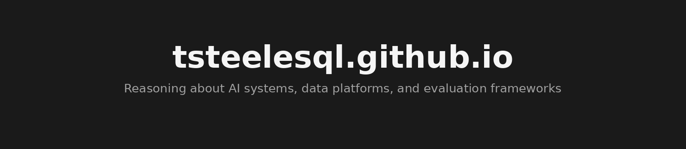

> A collection of personal projects exploring how to surface retrieval quality, latency, cost, and context growth in AI systems—so teams can make informed decisions before production issues occur.

**Live Site:** [tsteelesql.github.io](https://tsteelesql.github.io) | **Status:** Alpha / Personal Projects

## Header

**Portfolio Focus:** AI platform systems, retrieval, evaluation, and observability

**Supporting Capabilities:** Engineering skills used to design, evaluate, and operate AI systems in production

**Certifications:** Cloud & data certifications supporting production system design and operation

---

## Problem Statement

Teams building AI systems often struggle to understand where those systems slow down, degrade, or waste money as usage grows. Metrics are scattered, assumptions go untested, and by the time problems surface, they're expensive to fix.

**This portfolio is for:** Data engineers and AI platform teams enabling AI systems in production who need visibility into system behavior before committing to deployment.

## What This Portfolio Helps You Decide

Each project in this portfolio is designed to support concrete decisions:

- **Ship vs. hold:** Does retrieval quality meet thresholds before deploying a RAG system?
- **Investigate vs. tune:** Are latency spikes caused by retrieval, generation, or something else?
- **Expand vs. constrain:** How does cost scale as context grows—and where are the inflection points?
- **Trust vs. verify:** What evidence exists for a finding, and what remains uncertain?

These projects don't provide answers—they surface signals that inform your judgment.

## System Scope & Maturity

**Maturity level:** Alpha / Personal Projects

All systems showcased here are:
- Built end-to-end as learning and exploration tools
- Evaluated using production-inspired workloads, not production traffic
- Not deployed in employer production environments

**What these projects are NOT:**
- Production-hardened systems ready for enterprise deployment
- Benchmarked against industry baselines with statistical rigor
- Tested at scale beyond local development workloads

If you're evaluating these projects, treat them as working prototypes that demonstrate an approach—not as validated solutions.

## Featured Projects

### AgentLint
Evidence-driven code review with optional LLM explanations. Surfaces security, performance, and quality signals across Python and SQL files using a multi-agent LangGraph workflow.

- **Signals observed:** File path, line number, category, severity, rule_id, confidence score
- **Modes:** Default (<1s/file), explain (2-5s), deep (10-30s)—exposing cost/latency tradeoffs
- **Known gaps:** No cross-file analysis, no data-flow tracking, no FP/FN benchmarks yet

### Conversational Data Analyst
Natural-language interface for exploring SQLite databases with visibility into each pipeline stage: schema retrieval, SQL generation, safety validation, execution timing, and visualization selection.

- **Signals observed:** Retrieved schema context, generated SQL, validation outcomes, execution timing
- **Architecture:** Six-stage LangGraph pipeline with RAG-based schema retrieval (ChromaDB)
- **Known gaps:** No semantic SQL validation, no per-stage latency profiling, SQLite-only

### RAG Evaluation Framework
Evaluation toolkit for understanding RAG system behavior—retrieval quality, generation signals, latency percentiles, token usage, and cost estimation.

- **Signals observed:** Precision/Recall@K, NDCG, MRR, BLEU, ROUGE-L, semantic similarity, latency p50/p95/p99
- **Architecture:** Adapter pattern with decorator-based tracking, SQLite persistence, A/B comparison reports
- **Known gaps:** Single-turn evaluation only, no streaming support, limited provider error handling

## How It Works (High Level)

Each project follows a similar philosophy:

1. **Instrument the pipeline** — Capture signals at each stage (retrieval, generation, validation, execution)
2. **Persist observations** — Store findings in SQLite for repeatability and historical inspection
3. **Surface tradeoffs** — Expose mode options or configuration choices that reveal cost/latency/quality tradeoffs
4. **Enable inspection** — Provide CLI, JSON export, or dashboard views so signals can be examined, not just aggregated

No project claims to "solve" a problem. Each aims to make system behavior observable so that humans can reason about what's happening.

## Evaluation & Evidence Philosophy

**How to interpret results from these projects:**

- Metrics are **signals, not conclusions**. A low retrieval score suggests investigation, not automatic failure.
- These tools help you **explore and understand**, not guarantee outcomes.
- Results reflect **the workloads used to generate them**. Different data, prompts, or configurations may produce different signals.
- LLM-based evaluations (e.g., LLM-as-Judge) are **non-deterministic** and should be treated as heuristics.

**What the metrics do NOT prove:**

- That a system will perform similarly in production
- That findings generalize beyond the tested scenarios
- That absence of findings means absence of problems

**Sources of uncertainty:**

- Limited test coverage (not exhaustive workloads)
- No external validation against known-vulnerable or known-good baselines
- Evaluation methods themselves (BLEU, ROUGE) have documented limitations

## Limitations & Known Gaps

**Across all projects:**

- No production traffic testing
- No multi-tenant or high-concurrency evaluation
- No automated dataset generation for evaluation
- Limited to local development environments
- English-centric evaluation metrics where applicable

**Specific gaps are documented in each project's "Evidence & Limits" section** in the portfolio and in their respective repositories.

If you encounter scenarios where these tools produce misleading signals, that feedback is valuable—these are learning projects, and understanding failure modes is part of the work.

## Intended Users & Non-Users

**This portfolio is for:**
- Data engineers evaluating RAG system behavior before production
- AI platform teams who want to understand cost/latency tradeoffs
- Engineers who prefer evidence over intuition when making system decisions
- Anyone curious about instrumentation approaches for AI pipelines

**This portfolio is NOT for:**
- Teams seeking production-ready, enterprise-grade tools
- Users expecting polished UX or comprehensive documentation
- Anyone looking for benchmarks that prove a system "works"
- Organizations requiring compliance, audit trails, or SLAs

## Next Steps (Exploratory)

The following are areas of potential future work—not commitments:

- **False positive/negative benchmarking** — Evaluate AgentLint against known-vulnerable codebases to establish baseline accuracy
- **Multi-turn conversation tracking** — Extend RAG Evaluation Framework beyond single-turn queries
- **Cross-file analysis** — Add data-flow tracking to AgentLint for more contextual findings
- **Provider comparison** — Structured evaluation of different LLM providers across the same workloads
- **Load testing** — Understand how these systems behave under concurrent requests

These represent open questions, not a roadmap.

---

## Repository Structure

This repository contains the portfolio website itself:

```
index.html      # Portfolio page with project case studies
styles.css      # Styling (dark theme, responsive layout)
script.js       # Interactivity (accordion, modal, scroll effects)
assets/         # Project screenshots
```

**Live site:** [tsteelesql.github.io](https://tsteelesql.github.io)

**Project repositories:**
- [AgentLint](https://github.com/tsteelesql/AgentLint)
- [Conversational Data Analyst](https://github.com/tsteelesql/conversational-analyst)
- [RAG Evaluation Framework](https://github.com/tsteelesql/rag-eval-framework)

